# Turbo-SED Horizontal Architecture

This diagram has been restructured into a horizontal (Left-to-Right) flow to closely mimic the layout of your original **Figure 2**. The post-optimization features are highlighted to show exactly where they live inside the original layout.

```mermaid
graph LR
    classDef highlight fill:#e1f5fe,stroke:#039be5,stroke-width:2px,color:#000
    classDef loss fill:#fce4ec,stroke:#e91e63,stroke-width:2px,color:#000
    classDef inference fill:#e8f5e9,stroke:#4caf50,stroke-width:2px,color:#000
    classDef empty fill:none,stroke:none

    %% -- Inputs --
    Img(["Input Image"]) 
    Txt(["'A photo of a {tree}'"])

    %% -- Language Branch (Bottom Left in Fig 2) --
    subgraph LangEnc [Text Pipeline]
        TE["Frozen Text Encoder"]
        LA("Learnable Text Adapter<br>(Optimization)"):::highlight
        TE --> LA
    end
    Txt --> TE

    %% -- Visual Branch (Top Left in Fig 2) --
    subgraph VisEnc [Hierarchical Encoder]
        HE["Visual Backbone"]
        GC("Gradient Checkpointing<br>(Optimization)"):::highlight
        HE -.- GC
    end
    Img --> HE

    %% -- Intersection (Middle in Fig 2) --
    Sim((("⊗")))
    
    %% Connect Encoders to Intersection
    LA -->|E| Sim
    HE -->|F_v| Sim

    %% -- Decoder Blocks (Right side in Fig 2) --
    subgraph Block1 [Stage 1]
        direction LR
        C1[CER] --> FA1[FAM] --> S1[SFM]
    end
    
    subgraph Block2 [Stage 2]
        direction LR
        C2[CER] --> FA2[FAM] --> S2[SFM]
    end
    
    subgraph Block3 [Stage 3]
        direction LR
        C3[CER] --> FA3[FAM] --> S3[SFM]
    end

    %% Main FCV Flow
    Sim -->|F_cv| C1
    S1 --> C2
    S2 --> C3

    %% Top Skip Connections from Hierarchical Encoder (F2, F3, F4)
    HE -.->|F4| S1
    HE -.->|F3| S2
    HE -.->|F2| S3

    %% Bottom FCV Skip Connections (The bottom line traversing in Fig 2)
    Sim -.->|F_cv| C2
    Sim -.->|F_cv| C3

    %% -- Output Layer (Far Right in Fig 2) --
    S3 -->|F_h| Out["Output Layer"]
    Out --> Mask(["Final Mask Prediction"])

    %% -- Post-Optimizations (Applied at the very end based on phase) --
    Loss("Dice + Sigmoid Focal Loss<br>(Training Phase)"):::loss
    TTA("Test-Time Augmentation<br>(Inference Phase)"):::inference
    
    Mask -.-> Loss
    Mask -.-> TTA
```

### Layout Matching
- The **Image/Visual** flow runs across the top.
- The **Text (Prompt)** flow runs across the bottom.
- They merge at the **$\otimes$ (Cosine Similarity)** junction to create $F_{cv}$.
- $F_{cv}$ propagates horizontally through the **CER -> FAM -> SFM** blocks.
- $F_{2}, F_{3}, F_{4}$ drop straight down into the top of the **SFM** blocks exactly as drawn in Figure 2.
- The optimizations (Blue/Red/Green) are overlaid directly on this structure.
